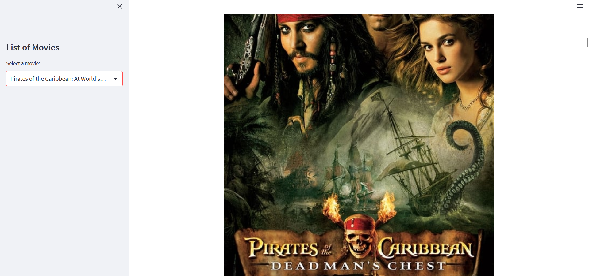

# Movie Recommendation System

## Overview
This is a Movie Recommendation System built using Streamlit. It suggests similar movies based on user-selected input using natural language processing techniques and cosine similarity.

## Features
- Select a movie from a list.
- Get recommendations for similar movies.
- View movie posters fetched from The Movie Database (TMDb).

## Technologies Used
- **Python**: The programming language used for development.
- **Streamlit**: For building the web application.
- **Pandas**: For data manipulation and analysis.
- **Scikit-learn**: For implementing the TF-IDF vectorizer and cosine similarity.
- **Requests**: For making API calls to TMDb.

## Installation

1. Clone the repository:
   ```bash
   git clone https://github.com/nitheesh2509/Movie-Recommendation-System-Similarity-Based-Film-Suggestions.git
   cd Movie-Recommendation-System-Similarity-Based-Film-Suggestions

2. Install the required packages:
   '''bash
   pip install -r requirements.txt
   '''

4. Run the Streamlit app:
   '''bash
   streamlit run movie_recommender_app.py
   '''

## Screenshots



